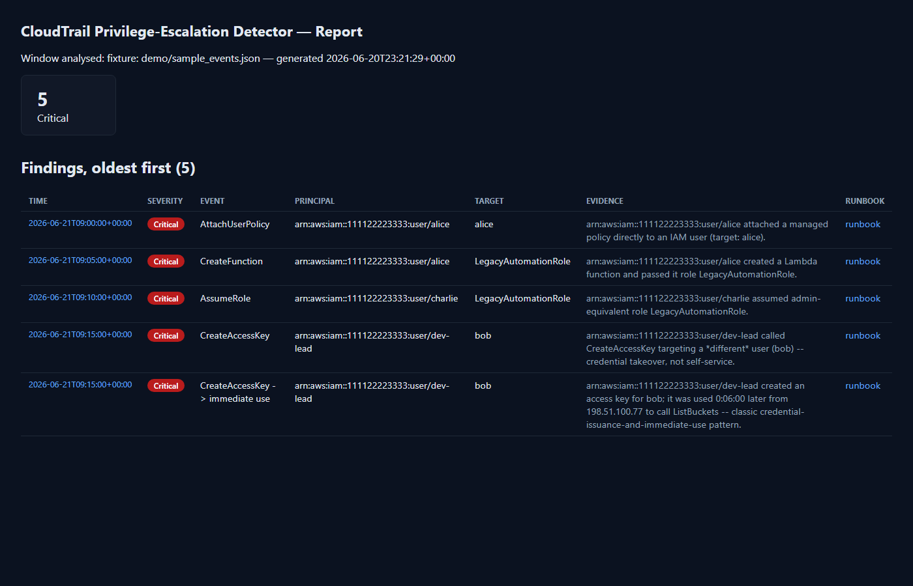

# cloudtrail-privesc-detector

The companion to [iam-privesc-mapper](https://github.com/harryc295/iam-privesc-mapper).
That tool finds privilege-escalation paths that *could* be used. This one
watches real AWS CloudTrail activity for the same known techniques actually
*being* used — plus a few patterns that only show up once you're looking at
a timeline of events instead of a static policy snapshot — and ships a
short incident-response runbook for each alert type.

See also [agent-privilege-mapper](https://github.com/harryc295/agent-privilege-mapper)
— the same find-the-dangerous-combination idea applied to AI agent tool
access instead of AWS IAM.

Together they cover both halves of the NIST CSF story for this threat: spot
the latent risk before it's exploited, and catch it in the act if it is.



## Quickstart (zero AWS setup)

```bash
pip install -r requirements.txt
python main.py --fixture demo/sample_events.json --admin-roles LegacyAutomationRole
# open output/report.html in a browser
```

Run it again without `--admin-roles` and compare — same 8 demo events,
fewer/lower-severity findings, because the tool can't yet confirm which
roles are admin-equivalent:

```bash
python main.py --fixture demo/sample_events.json
```

| | Findings | Critical | Medium |
|---|---|---|---|
| Without `--admin-roles` | 4 | 3 | 1 |
| With `--admin-roles LegacyAutomationRole` | 5 | 5 | 0 |

That difference is the actual point of pairing the two tools: run
`iam-privesc-mapper` against the account first, feed its
`already-admin-equivalent` findings into this tool's `--admin-roles`, and
every AssumeRole/PassRole finding here gets resolved to a confirmed
severity instead of a "go check manually" guess.

## Running against a real account

```bash
python main.py --profile my-readonly-profile --lookback-hours 24
```

Needs `cloudtrail:LookupEvents` (read-only) — that's it. No S3 export
bucket, no Athena table, no infrastructure to deploy: `lookup_events` reads
the default 90-day event history every AWS account already has.

## What it detects

- **Directly observed dangerous actions** (9 of them): the same self-privesc
  IAM actions `iam-privesc-mapper` checks for as *possible* — `Attach*Policy`,
  `Put*Policy`, `CreatePolicyVersion`, `SetDefaultPolicyVersion`,
  `UpdateAssumeRolePolicy` — except here they've actually happened.
- **Credential takeover**: `CreateLoginProfile` / `UpdateLoginProfile` /
  `CreateAccessKey` where the target is a *different* user than the caller
  (self-service key rotation is explicitly excluded — that's normal).
- **Role passing**: `lambda:CreateFunction` / `ec2:RunInstances` events that
  pass a role — severity depends on whether `--admin-roles` confirms that
  role is dangerous.
- **AssumeRole into a confirmed admin-equivalent role** — deliberately
  *not* checked without `--admin-roles` context, because AssumeRole on its
  own is far too common and mostly benign to alert on blindly.
- **The one genuinely time-windowed correlation**: a new access key issued
  for someone, then used within minutes by that key — classic
  credential-issuance-and-immediate-use. (Note: `iam:PassRole` itself never
  appears as its own CloudTrail event — it's only visible as a parameter
  inside the action it's paired with, which is why role-passing is a
  single-event check here, not a correlation.)

## Known limitations (read before trusting a finding)

A successful CloudTrail event means IAM already authorized the action —
this tool can't tell "an admin doing admin things" apart from "someone who
shouldn't have had that permission, using it," on its own. Every finding
here is "this powerful action happened, go look," not a verdict — that's
exactly what the runbooks and the `--admin-roles` cross-reference are for.
Denied calls (`error_code` set) are deliberately excluded — only successful
actions are reported in v1.

## Architecture

```
detector/collector.py    boto3 cloudtrail.lookup_events (read-only) -> normalized event dicts
detector/detectors.py    single-event + windowed-correlation detection rules
detector/runbook_map.py  rule_id -> incident-response runbook
detector/report.py       string.Template -> static HTML timeline (no web framework)
runbooks/*.md            one runbook per finding family: contain, investigate, notify, prevent
main.py                  CLI glue
```

No database, no server — same philosophy as `iam-privesc-mapper`: the
account's own CloudTrail history is the state, a static HTML file is the
dashboard.

## Tests

```bash
python -m pytest
```

Synthetic CloudTrail-shaped event fixtures asserting each detector fires
(and doesn't fire) correctly — including that denied calls, self-service
key rotation, and out-of-window key use are all correctly ignored.

## Roadmap

- A "denied attempt" detector (same rules, but for `AccessDenied` events) —
  signals active probing even when the attempt fails
- Direct integration with `iam-privesc-mapper`'s output instead of a
  hand-off file, if both tools end up run from the same pipeline
- EventBridge rule + Lambda for real-time alerting instead of polling

## License

MIT
